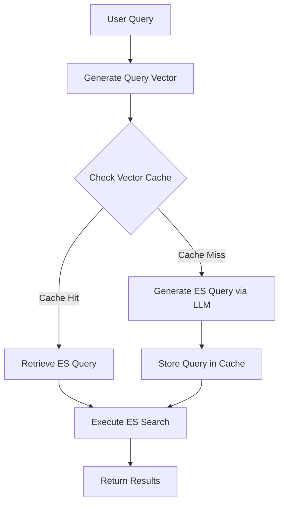

# HRLens

HRLens is an AI-powered HR analytics and search platform that enables natural language querying of HR data using a combination of LLMs, vector search, and Elasticsearch.

## Features

- Natural language query processing
- Semantic search with vector similarity caching
- Elasticsearch-based data storage and retrieval
- Performance tracking and monitoring

## Architecture

### Core Components

1. **Search Agent**: Converts natural language to Elasticsearch queries
2. **Vector Cache**: Stores semantically similar queries using Milvus
3. **Elasticsearch**: Primary data storage and search engine

### Query Processing Flow



1. **Query Input**
   - User submits natural language query
   - System generates vector embedding

2. **Cache Check**
   - Query vector compared with cached vectors in Milvus
   - If match found: retrieve associated Elasticsearch query
   - If no match: generate new query via LLM

3. **Search Execution**
   - Execute Elasticsearch query (cached or newly generated)
   - Return results to user
   - Store new queries in vector cache for future use

## Setup

### Prerequisites

- Python 3.9+
- Elasticsearch 8.x
- Milvus 2.x
- OpenAI API key

### Installation

1. Clone and setup environment:
```bash
python -m venv venv
source venv/bin/activate  # Windows: venv\Scripts\activate
pip install -r requirements.txt
```

2. Configure environment (.env):
```bash
OPENAI_API_KEY=your_api_key
ES_HOSTS=http://localhost:9200
ELASTICSEARCH_INDEX=hr_lens
MILVUS_HOST=localhost
MILVUS_PORT=19530
```

3. Start services:
```bash
docker-compose up -d
```

4. Run application:
```bash
uvicorn app.main:app --reload
```

## API Endpoints

### Search
```http
POST /api/search
Content-Type: application/json

{
  "query": "Find engineers in India"
}
```

### Cache Statistics
```http
GET /api/cache/stats
```

### Clear Cache
```http
POST /api/clear_cache
```

## Dependencies

- FastAPI
- Elasticsearch
- OpenAI
- LangChain
- Milvus
- Pydantic

For detailed configuration options, see `app/config.py`.